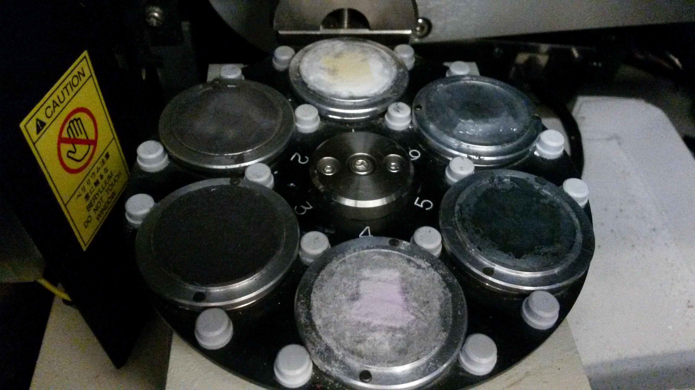
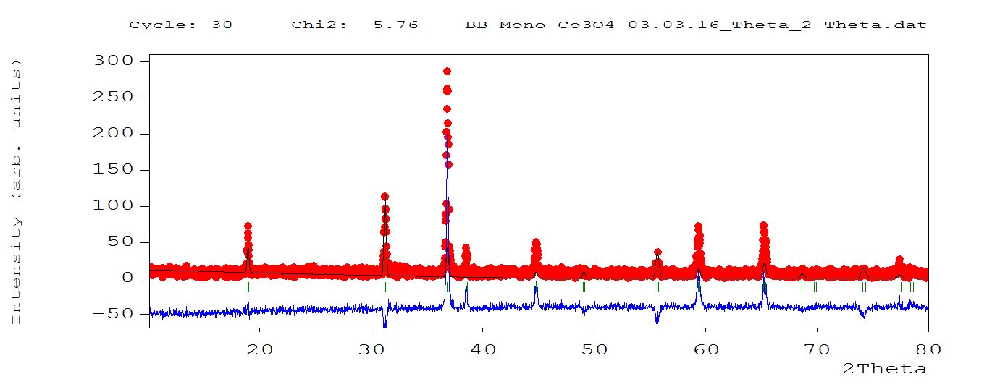
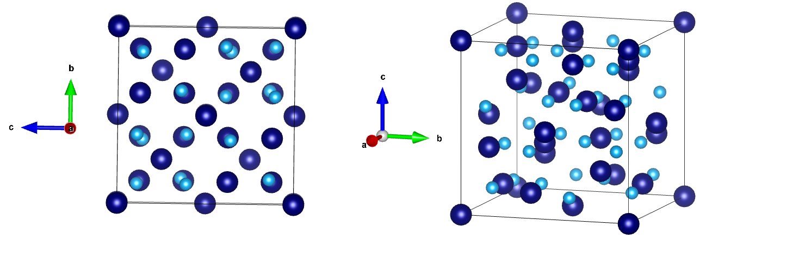

# xRay_Diffraction
Using an X-Ray diffractometer to identify the lattice structure of mineral samples. 

As the samples are bombarded with x-rays, a diffraction pattern is analyzed and compared to an established database of known lattice structures to identify the chemical structure. Once the substance is identified with reasonable certainty, a 3d model of the lattice is produced. The example below is for co3o4. 

The complete document can be seen under xdr_ramirez.pdf
 

